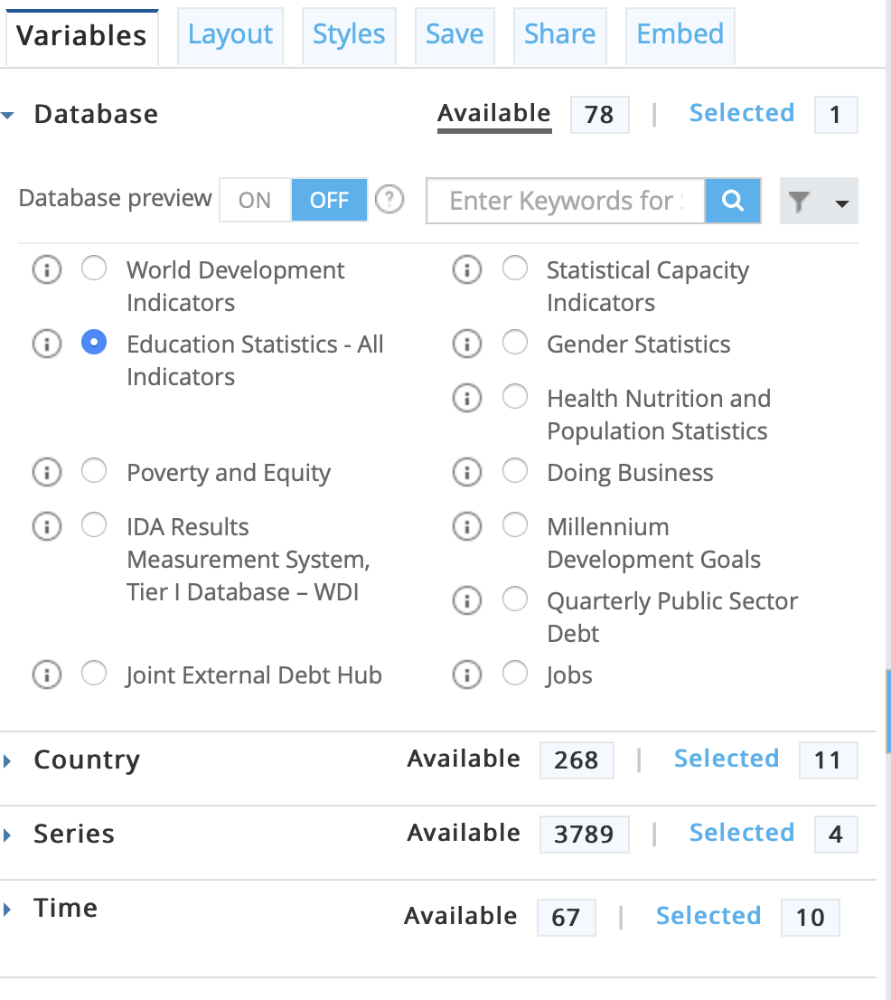
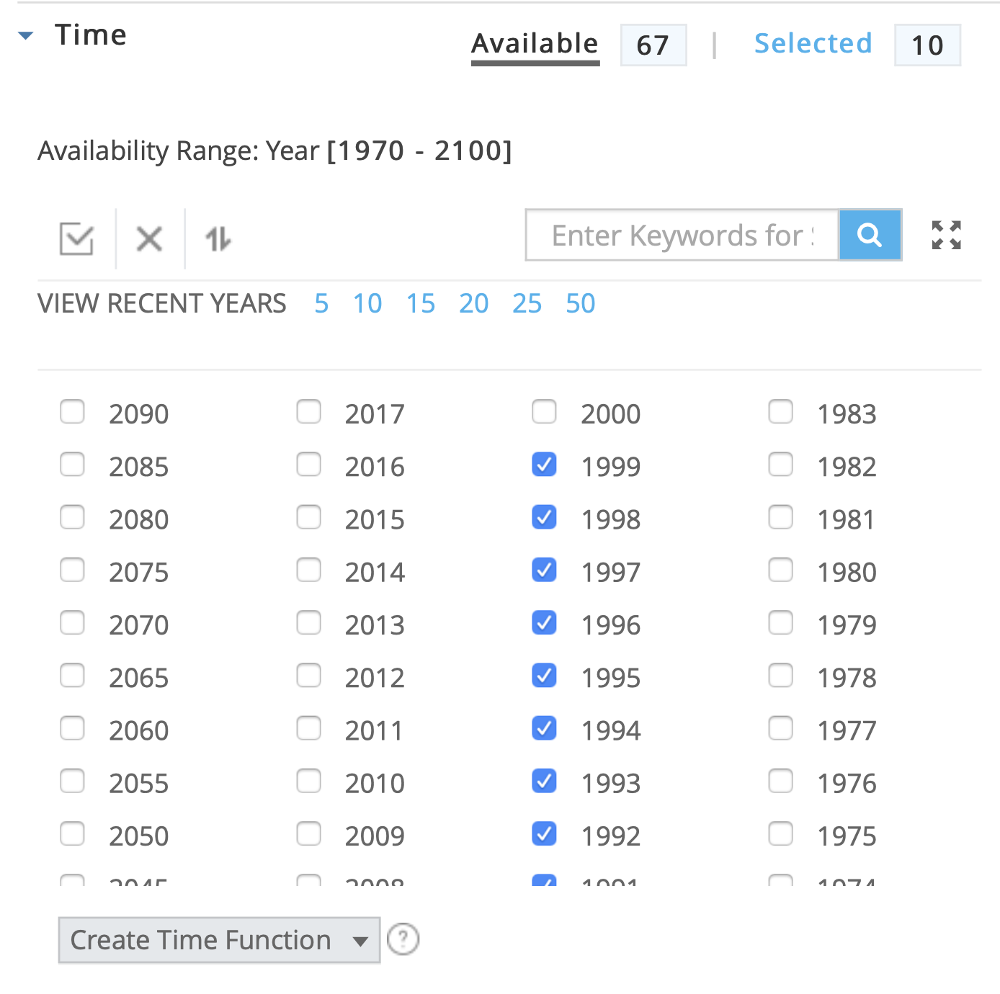
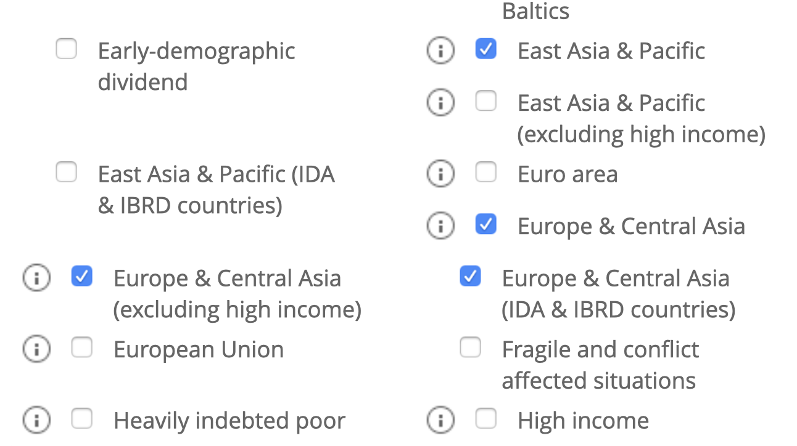
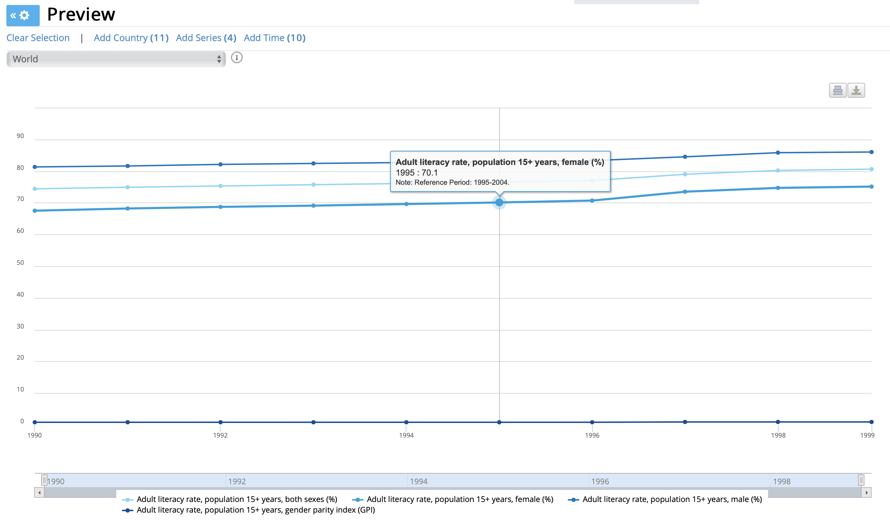
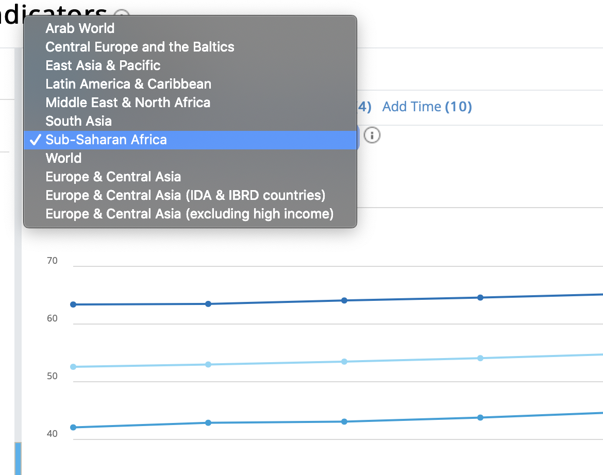
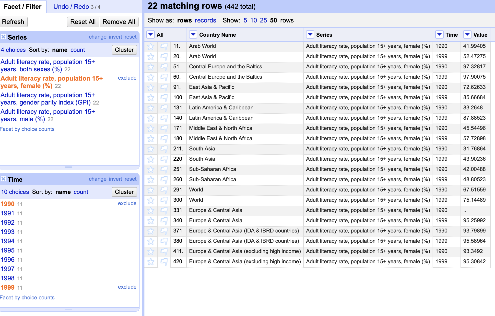
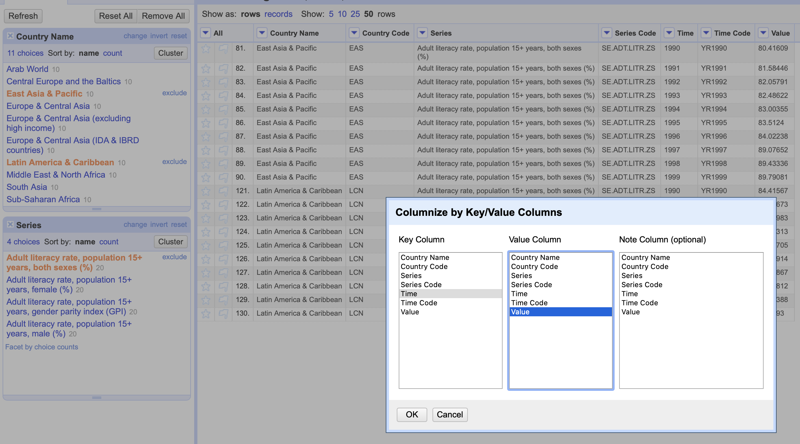
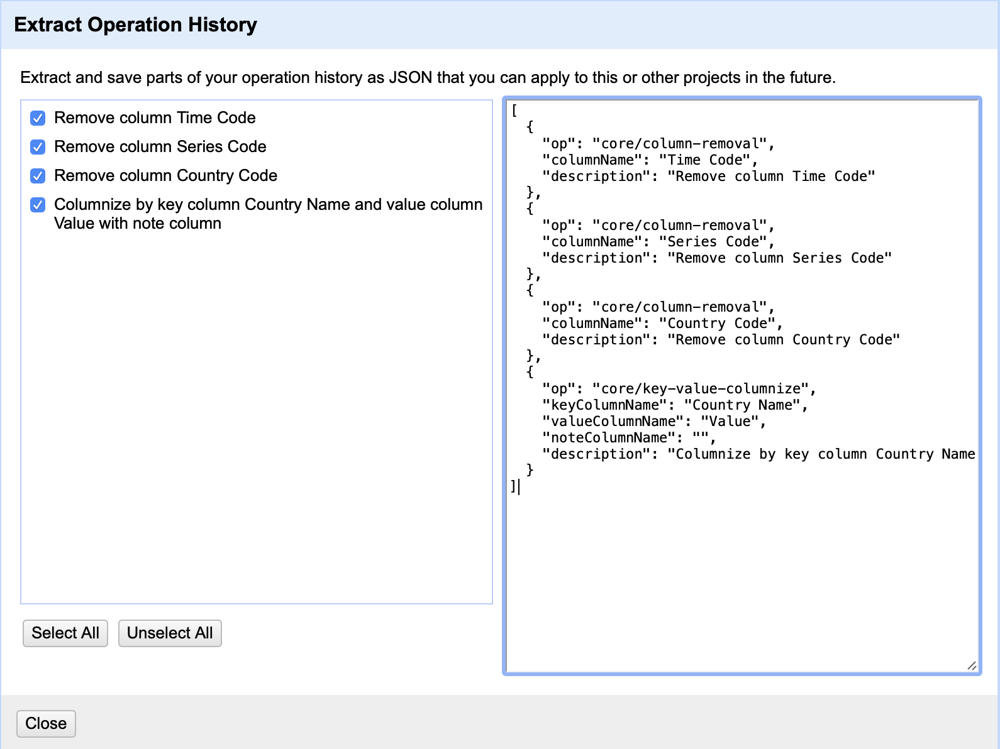
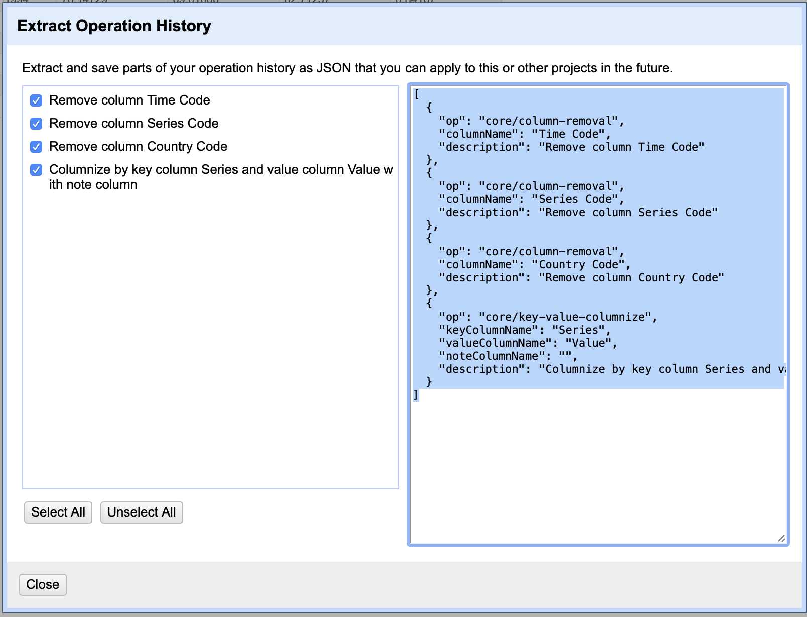

# Global Literacy Rate in the 90s

## Literacy Rates Per Year From 1990-1999 by Sex and Region

## Final Project for Elijah Holt

### Process:

Via the world bank website, I first selected what topic of data I wanted (agriculture, GDP, government, etc.) and chose education. Then I was given the option to choose what kind of education data I wanted. This was the most difficult part. There were over 3000 options of data points to choose from. For example, there was Percent Retention Grade 1, Percent Retention Grade 1 Male, Percent Retention Grade 1 Urban, etc. There were more types of data on education than I had considered, from teacher salary to number of kids to a textbook. I decided to focus on literacy rate because it had very accessible data that was easy to understand what each point was: total, male, female. Then I had to select what years I wanted the data for. Not only did it include data from 1970 onwards, there were also options for future projections, like 2040 or 2065. Since I am interested in history, I decided to focus on the 90s. So now I had 10 years of 3 data points. Next I had to choose which part of the world. It would be counterproductive to choose every country, as that’s too much data for the scope of this assignment. There was an option to select aggregates, which at first I thought meant if you selected North America, say, it would give you the data for each country in North America. But instead it’s the data point for the literacy rate of all of North America. I decided to focus on comparing data by continent, but this was easier said than done. There were multiple versions of some regions like East Asian lower income countries versus East Asia versus East Asia excluding high income countries. There were also overlapping regions/continents. There would be Europe and Central Asia, Euro Area, Central Europe & Baltics, European Union, and more. This was true for most every region of the world, though to a lesser degress than Europe. Eventually I narrowed it down to what I thought was the best representation of the regions of the globe - though some overlap, like Southeast Asia and Pacific Nations. I thought it was better to be more thorough than not, so erred on the side of overlap rather than risk gaps.

### Below are screenshots of what the process of selecting what data I wanted was like:

     

I went through each region’s data set, looking through the values to make sure there were no wild outliers. This was really easy to do manually using the World Bank Data tools, as it automatically produced a line chart of literacy rate over the years for each separate region. 

I could simply look over them to see if there were any notable differences or spikes. I ran into some problems with, surprisingly enough, data from Europe and North America. There wasn’t any data for North America and the European Union. Europe and Central Asia only had data from 1995 onwards. So, I went to reevaluate what regions I had chosen. There was one called “Euro Area,” and in lieu of North America I selected the United States. I also decided to include China and Russia for comparison purposes as they are both large enough to constitute their own region of the globe. Russia didn’t have any data, and China only had 1990, which was unhelpful.

Eventually I added every region that said “euro” in it, plus the United States and Canada for North America. Just for good measure I also added the United Kingdom, France, and Germany to manufacture some sort of representation to Europe, as those are the most (in my understanding) economically powerful countries in Europe. What I ended up with was:
* No data for the USA or Canada
* No data for Russia (still)
* Partial data for China 
* No data for the European Union or Euro Area
* Partial data for Europe and Central Asia
* Full data and the data I am keeping for: Middle East & North Africa; South Asia; Sub-Saharan Africa; Central Europe and the Baltics; Arab World; East Asia & Pacific; Latin America and Caribbean; “Europe and Central Asia Excluding High Income”; “Europe and Central Asia IDA & IBRD Countries"; World

### Regions I ultimately selected:

All of this work had to be done all together because if you left the browser inactive for too long, your session would be times out. This happened to me and I had to manually re-select all the options that I had been looking at before. Once I had a functional table in the World Bank Data tool, I checked to see that I had all my years and regions that I had selected, and then exported as a .csv file. (World Bank Data also allows you to download their charts directly as jpeg, png, pdf, or SVG vector files, but they're not visually appealing.)

Then when I uploaded it to google slides it was incomprehensible. So I needed to use openrefine. The format is that each value (literacy total, literacy male, and literacy female) is listed in a big chunk so that you don’t know which one is which. For example, the first row is literacy total for the arab world in 1990. The next is arab total literacy in 1991, then 1922, and so on. Then it will start the year count over again, giving you female literacy in the arab world in 1990. Basically it was organized by region, then type of data point (total, male, or female) and then year. But it was really difficult to figure out what order the literacy data was in. In other words, it came in blocks of male/female/total, but I didn’t know which black was which. Was the first one male? Or was it total? Plus, with this large of a data set and so many different variables, the analysis that I could do via google sheets would be complicated and limited. 

I then used openrefine to turn that one csv file into four: one of all the total literacy values, one of all female values, one of all male values, and one that listed the gender parity index for each region by year. Then, I imported each of those to a separate sheet of google sheets, so now I had 5 sheets: three literacy rates, one of all the data, and one of the gender parity index for literacy. 

In order to produce visualizations, I had to bring the data back into openrefine. There was simply too much information to represent in one chart, and both google sheets and datawrapper were having trouble processing the sheer volume of data. So, I thought about what analysis I wanted to see in particular and how I was going to accomplish that. First, in openrefine I changed all the years from date values to text values. As date values they were being interpreted as representing a continuous flow of data where, for my purposes, they instead meant their own discrete value. That alone I think would have fixed some of the problems datawrapper and google sheets were having, but I could edit my data further to produce charts that were actually meaningful analysis rather than just a summary of data. I wanted a chart comparing male and female literacy rates, so I only included rows with those listed as the series. I wanted to compare East Asia and Latin America because they seemed pretty close throughout the spreadsheets I looked at. I wanted a comparison, regionally, between 1990 and 1999, so I left those two values. However, these still weren’t specific enough for an effective visualization. So I got more specific with what I wanted to compare. I want to compare the total literacy rates throughout the 90s between East Asia and Latin America so I need to exclude all other regions and other literacy rate data sets. I wanted to compare the three types of literacy rates throughout the 90s on a global scale, so I need to exclude every region other than World. I wanted to compare each region’s change from 1900 to 1999 in female literacy rates meaning I have to exclude all other years and all other literacy data types. However, that still wasn’t enough to give me what I wanted - I needed the value I wanted to compare to be in the column: the two regions, the three literacy rates, and the two years (which could be then transposed to be regions if necessary).

### Examples of how I used OpenRefine to pare down the data:

   

After I polished that data to be specifically what values I wanted with the correct row labels, I uploaded it to google sheets to create the chart visualizations you see below. 

<iframe width="600" height="371" seamless frameborder="0" alt="Data visualization global literacy" scrolling="no" src="https://docs.google.com/spreadsheets/d/e/2PACX-1vS43WxZzEocj96APvPkyPxwb-sqkEmEgdPrwvNJ8uXkpGJvOK0GrvcHEdpKTPS-d6O0rulX52J-j4Nx/pubchart?oid=1508181792&amp;format=interactive"></iframe>

<iframe width="852" height="455" seamless frameborder="0" alt="Data visualization regional female literacy" scrolling="no" src="https://docs.google.com/spreadsheets/d/e/2PACX-1vS43WxZzEocj96APvPkyPxwb-sqkEmEgdPrwvNJ8uXkpGJvOK0GrvcHEdpKTPS-d6O0rulX52J-j4Nx/pubchart?oid=657462360&amp;format=interactive"></iframe> 

<iframe width="600" height="371" seamless frameborder="0" scrolling="no" alt="east asia compared to latin america total literacy" src="https://docs.google.com/spreadsheets/d/e/2PACX-1vS43WxZzEocj96APvPkyPxwb-sqkEmEgdPrwvNJ8uXkpGJvOK0GrvcHEdpKTPS-d6O0rulX52J-j4Nx/pubchart?oid=936114678&amp;format=interactive"></iframe> 

Prior to making these charts, I analyzed the data myself in google sheets. Here's what I found:

### Male Literacy Rates

Europe dominates male literacy rates, claiming the top 40 values - though it's important to note that there are 3 different opportunities (i.e. three different regions that encompass parts of Europe) for Europe to claim those spots in a way that probably overlaps many countries. But even then, if you crudely estimate and divide by 3ish, they still take the top dozen spaces in a solid monolith in the 90th percentile. Next closest values for other regions like Latin America or East Asia are not far off, in the high 80s.
Lower values vary by region more, but are similar geographically, with South Asia, the Middle East, and parts of Africa having values ranging from 58% up - which is not that bad for the lowest literacy rates!
The world literacy rate for males was between 81-86% throughout the 90s.

### Female Literacy Ratees

Again, Europe claims the top 40 spots, but this time with a greater variance, from slightly under 98% to as low as 93%.
The decline in literacy rates is much sharper for female literacy than male without even looking at the two datasets next to each other.
The lowest female literacy rates are in the low 30s, again all in South Asia. the Middle East and Africa follows, with a variety of order but all generally between 40-50%.
The world female literacy rates are between 65-80% and went up a fair amount over the course of the 90s.

### Literacy Gender Parity Index

Central Europe and the Baltic States have the top ten highest gender parity index values from 1990 to 1999 - in that order. They're all pretty similar values though, between 0.982 and 0.988. (Still very impressive numbers!)
Next is undeniably Latin America, as the next 8 values are Latin America in 1990 and 1993-99.
South Asia has the lowest gender parity index out of any other region for all ten years, except in 1998 it was slightly above where the Arab World was in 1990.
The world average lays solidly between .83 and .88 throughout the 90s.

### Total Literacy Rates

When considering the previous insights, it's no surprise that Europe again dominates, with total literacy rates all in the upper 90s. Next is Latin America though, all ten years between 84-89%, followed some years of East Asia intermixed with World total literacy, in the mid 70s and low 80s.
The lowest literacy rates are 1990-1997 in South Asia, from 45-51%, but then there is a distinct jump where South Asia's literacy increases by around 5% from 1997 to 1998, and then levels off again in 1999.
In terms of lowest literacy, South Asia is followed by Africa and the Middle East, but none of them were ever less that 50% literacy in the 90s.

### Pivot Table Analysis

A pivot table of World data shows that the average literacy rate of the world through the 90s was 77.76%.
The highest average literacy in the 90s was Central Europe, but Latin America and East Asia also had average literacy rates in the 90s above 90%.
South Asia had the lowest average literacy in the 90s at just above 50%.
A pivot table of female literacy shows a greater range of values, from the lowest being about 37% for South Asia in the 90s. The highest, again, is Europe in the high 90s.
Here is where East Asia and Latin America fall behind, with an average female literacy in/around the mid 50s.
The world average is 71.52%, around 6% lower than the total literacy rate and more than 12% lower than male literacy rate.
The lowest average male literacy rate throughout the 90s was South Asia at 62.5%. Sub-Saharan Africa wasn't much higher, at about 65%. the Arab World and North Africa had male literacy rates in the low 70s.
The average world gender parity index of literacy rates during the 1990s was 0.83.
The lowest average gender parity index in the 1990s was South Asia at .585.

### Overall

This data was super interesting because it both confirmed and denied some pre-concieved notions I had about the state of literacy in the world. I was suprised at the global literay rate in the 90s being around 77%, I expected it to be lower. I was not suprised at the disparity between male and female literay rates, though it was interesting to see that as literacy rates rose, the gender gap grew smaller. I definitely expected Europe to have high literacy, and I assume the same for North Amerca even though this data didn't have anything on North America. I wouldn't have guessed that Latin America had higher literacy rates most of the time than East Asia, but I think that is due to two things: when I think of East Asia I think of the high urban densities of China and Japan, not more rural Southeast Asian countries; when I think of Latin America I think mostly of countries in Central America, forgetting the affluence and development of countries like Argentina or Brazil. Lastly, I was surprised that South Asia was the region with, overwhelmingly, the lowest literacy rates - I would have guessed, based on how American media covers international news, that it would be Sub-Saharan Africa. The global focus seems so concerned with education in Africa, even though other regions have been signifiantly less literate. I assume that much of this dataa has changed and hhopefully literacy has gone up a lot in the psat 20 to 30 years, so I don't think it's very fair to use these former trends to inform current opinions. This is simply how it used to be. And while that is important context and history, it's also important to not discount the possibility of change - hopefully for the better. 
